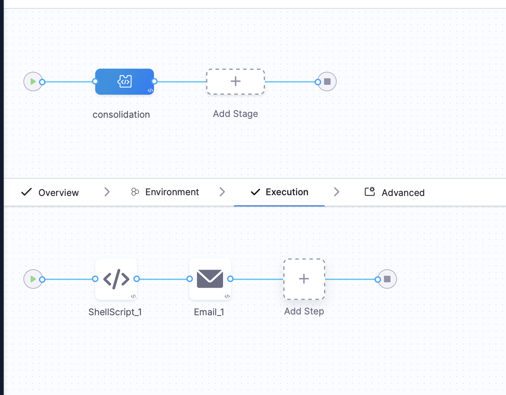

# GCP Unattached Volumes Management



This repository provides resources for identifying and managing unattached persistent disks in Google Cloud Platform (GCP). It includes policies, scripts, and pipeline configurations to automate the detection and handling of idle volumes, aiding in cost optimization and resource management.

## Features

- **Policy Definition**: Utilize the `idle-volume-asset-governance-policy.yaml` to define criteria for identifying idle volumes.
- **Automation Scripts**: Execute the `shell-script-format.sh` to process and manage identified volumes.
- **Pipeline Integration**: Implement the `sample-pipeline.yaml` to automate the workflow within your CI/CD processes.

## Repository Contents

- `idle-volume-asset-governance-policy.yaml`: Defines the governance policy for detecting idle volumes.
- `sample-pipeline.yaml`: Sample pipeline configuration integrating the detection and management processes.
- `shell-script-format.sh`: Shell script to process the identified idle volumes.
- `assets/`: Contains supporting images such as `sample-pipeline.png`, `pipeline-variables.png`, and `trigger.png`.

## Setup and Usage

1. **Define the Policy**: Customize the `idle-volume-asset-governance-policy.yaml` to set the parameters for what constitutes an idle volume in your environment.

2. **Configure the Pipeline**: Integrate the `sample-pipeline.yaml` into your CI/CD platform, ensuring that all variables and paths are correctly set.

3. **Execute the Script**: Run the `shell-script-format.sh` to process the volumes identified by the policy. Ensure that the script has the necessary execution permissions.

   ```bash
   chmod +x shell-script-format.sh
   ./shell-script-format.sh
